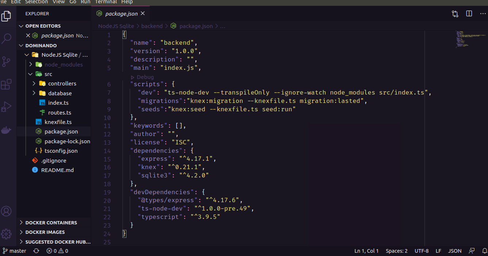

# Estudando o Básico de NodeJS e Knex + Sqlite3
> Simples CRUD com Knex+Sqlite3.

[![NPM Version][npm-image]][npm-url]
[![NODE Version][node-image]][node-url]
[![KNEX Version][knex-image]][knex-url]

Aprendendo o básico para criar um Simples CRUD em NodeJS utilizando knex com banco sqlite3.



## Instalação

Linux:Dentro do diretório NodeJS Sqlite/backend

```sh
yarn install 
```

## Configuração para Desenvolvimento

Executar o comando abaixo para rodar o projeto.

```sh
yarn dev
```

## Contato

William Ribeiro – [@WilliamRibeiro](https://www.linkedin.com/in/william-ribeiro-0b5ab911a/) – sbrdigital15@gmail.com


## Contributing

1. Faça o _fork_ do projeto (<https://github.com/stilljag/NodeJS/fork>)
2. Crie uma _branch_ para sua modificação (`git checkout -b feature/fooBar`)
3. Faça o _commit_ (`git commit -am 'Add some fooBar'`)
4. _Push_ (`git push origin feature/fooBar`)
5. Crie um novo _Pull Request_

[npm-image]:https://img.shields.io/badge/NPM-V6.14.5-brightgreen
[npm-url]: https://www.npmjs.com/package/npm
[node-image]:https://img.shields.io/badge/NODE-V12.16.3-green
[node-url]: https://nodejs.org/docs/latest-v12.x/api/
[knex-image]:https://img.shields.io/badge/KNEX-V0.21.1-orange
[knex-url]: http://knexjs.org/

